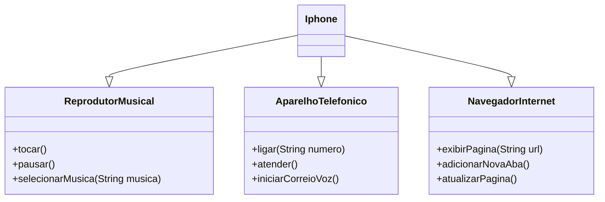

# Projeto Iphone em Java

Este projeto demonstra a implementação de um modelo básico de um iPhone em Java, que implementa as funcionalidades de um reprodutor musical, um aparelho telefônico e um navegador de internet.

## Estrutura do Projeto

O projeto contém as seguintes interfaces e classes:

- `ReprodutorMusical`: Interface que define os métodos para um reprodutor musical.
- `AparelhoTelefonico`: Interface que define os métodos para um aparelho telefônico.
- `NavegadorInternet`: Interface que define os métodos para um navegador de internet.
- `Iphone`: Classe que implementa as três interfaces acima, representando um iPhone.

